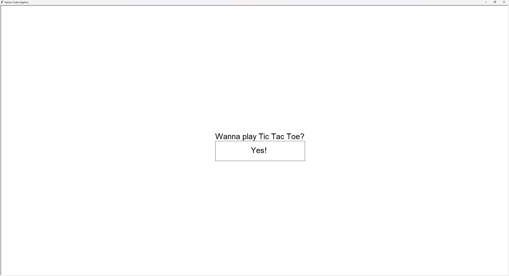
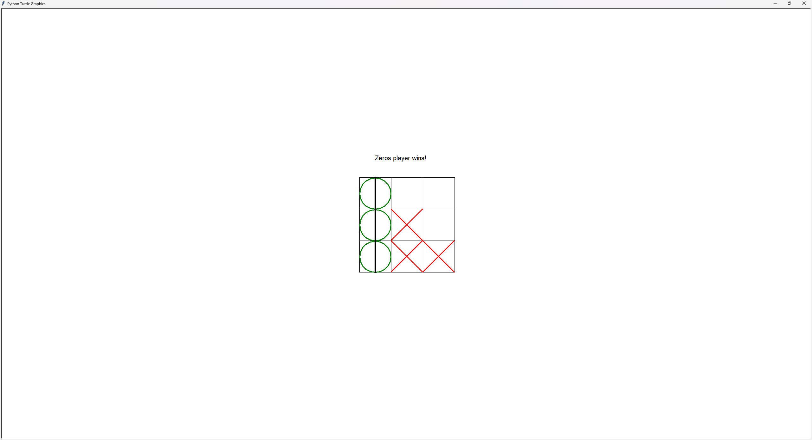

TIC-TAC-TOE
---

## Опис проєкту
гра зроблена за допомогою бібліотеки **Turtle**, для того щоб ознайомитись з принципом роботи цієї бібліотеки та використанням мови програмування Python у розробці

У грі ви можете грати з другом на одному пристрої 



## Як запустити проєкт?

Для запуску проєкту вам буде потрібно створити віртуальне оточення (`venv`), після чого активувати його

Щоб це виконати, вам потрібно слідувати пунктам нижче

1. Створіть віртуальне оточення

Відкриваємо термінал, та створюємо віртуальне оточення командою:

Для **Windows**:
```python
python -m venv venv
```

Для **MacOS**:
```python
python3 -m venv venv
```

2. Активуйте віртуальне оточення

Активуємо віртуальне оточення командою:

Для **Windows**:
```python
.\venv\Scripts\activate.bat
```

Для **MacOS**:
```python
source venv/bin/activate
```
